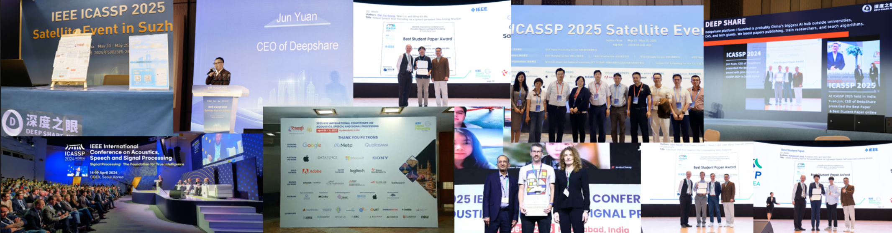
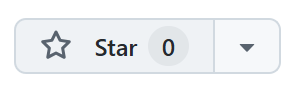
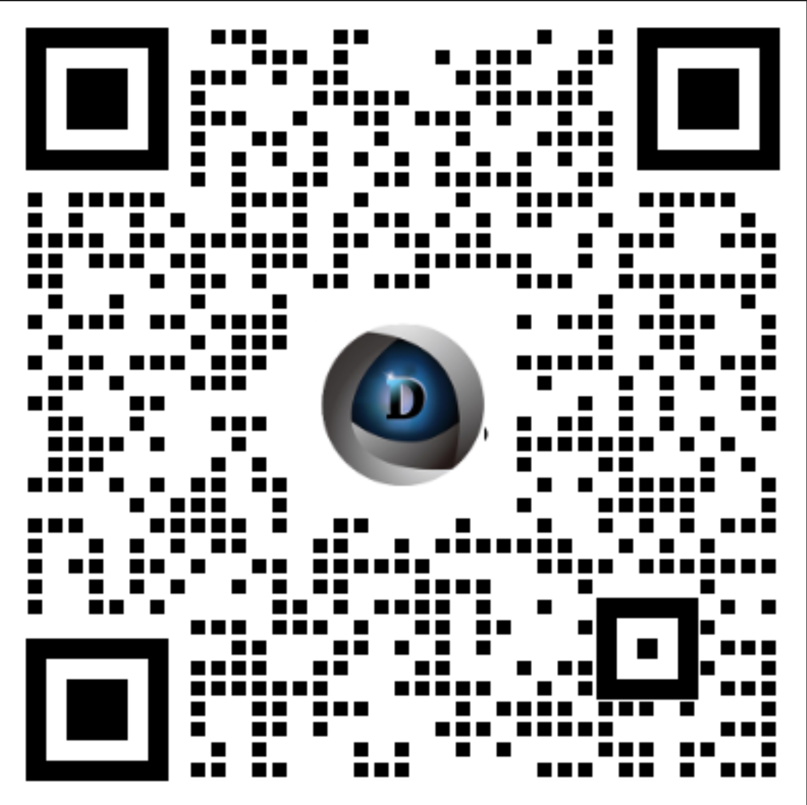

# 【深度之眼】Kaggle竞赛使用手册

**引言**

写上参加过Kaggle比赛，我会看简历。

得过一次10%，我会给电话面试。

得过2次或者以上10%，我会给on site面试。

得过一次前10，我们会谈笑风生。

(在 Kaggle 上一次比赛的结果除了排名以外，还会显示三挡:Prize Winner，10%，25%所以刚刚接触 Kaggle 的人很多都会以 25% 或是 10% 为目标。)

**——Walmart lab data scientist 面试官**

---

说明：本文档包含了深度之眼往期举办的部分大班赛资料以及对应课件，感兴趣的同学可以自行阅读，对录播课程感兴趣的同学点赞关注，然后凭截图扫码领取！！！感谢大家的支持

同时欢迎大家了解我们深度之眼，希望能够给大家带去最实用的知识：

https://deepshare.feishu.cn/wiki/Tb7IwetysiLErGk3NQwcQdHznPb?from=from_copylink

---

## 什么是Kaggle竞赛？

Kaggle是一个在线平台，企业和机构会在这里发布用数据解决实际问题的“题目”（比如预测房价、识别疾病等），全球的数据爱好者（学生、工程师、研究者等）可以组队参赛，用数据分析、编程、机器学习等技术做出最优解决方案，最终按成绩排名，优胜者可能获得奖金或企业的工作机会。

## Kaggle奖牌划分机制是什么样的？

Kaggle一共有四种方式获得奖牌，分别是Competitions、Datasets、Notebooks和Discussion这四块，只要完成对应的标准，就能获得奖牌。我们的主要目标是获得Competitons的奖牌。Kaggle Competitons的奖牌划分机制主要基于参赛者在比赛中的排名百分比，但具体规则可能因比赛类型和主办方设定而有所不同。以下是常见的划分方式及注意事项：

### **奖牌类型与常见划分比例**

* **金牌（Gold）** ：通常授予排名前 1% 的参赛者。
* **银牌（Silver）** ：通常授予接下来的 **2%**（即前**1%~3%**）。
* **铜牌（Bronze）** ：通常授予接下来的 **3%**（即前**3%~6%**）。
* **总覆盖范围** ：前 **6%** 的参赛者可能获得奖牌，但具体比例可能因比赛而异。

### **比赛类型差异**

* **Featured Competitions（精选比赛）** ：
  * 通常有奖金池，奖牌划分严格按百分比或绝对名次（例如前 **3** 名）。
  * 例如：某些比赛可能规定金牌为前 **3** 名，银牌为 **4~10** 名，铜牌为 **11~20** 名。
    **例如：**

    名称：NFL Big Data Bowl
    链接：https://www.kaggle.com/competitions/nfl-big-data-bowl-2020

    名称：APTOS 2019 Blindness Detection
    链接：https://www.kaggle.com/competitions/aptos2019-blindness-detection
* **Research Competitions（研究比赛）** ：
  * 学术性质较强，可能更注重解决方案的创新性，奖牌划分可能更宽松或基于其他标准。
    **例如：**

    名称：Google - American Sign Language Fingerspelling Recognition
    链接：https://www.kaggle.com/competitions/asl-fingerspelling

    名称：PlantTraits2024 - FGVC11
    链接：https://www.kaggle.com/competitions/planttraits2024

## kaggle竞赛对个人有什么价值或意义？

实战学习：在kaggle竞赛中，您能在竞赛中学会处理代码、训练AI模型，积累“真正能用”的经验

简历增色：得到kaggle金牌或银牌奖项，是AI能力的证明，也是人工智能相关大公司的敲门砖

接触业内：竞赛题目大多来自企业真实需求（比如银行预测用户贷款风险、医院分析病历），您能提前了解行业痛点，甚至解决方案可能被企业采用，提升个人竞争力

**获得资源：**

* 能够免费使用平台的计算资源跑模型
* 能看到大神们的解题思路和代码
* 认识志同道合的人工智能同好，认识相关圈子，提升业内人脉

---

说明：需要课程回放的同学可以扫码，凭点赞关注截图找小享免费领取哦！！！

