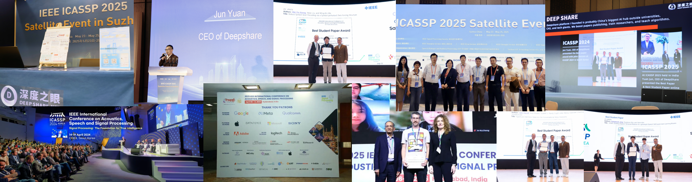

# 【Kaggle】UM - MCTS变体的游戏实力

**说明：本项目中包含了部分方案解析、录播课件、baseline、以及推荐资料等，欢迎大家关注点赞+收藏！！！**

**比赛名称：UM - MCTS变体的游戏实力**

比赛链接：**https://www.kaggle.com/competitions/um-game-playing-strength-of-mcts-variants**

**比赛任务：预测给定游戏中一种 MCTS 变体相对于另一种 MCTS 变体的性能**

比赛方向：**强化学习**
----------------------

欢迎大家了解我们深度之眼，希望能够给大家带去最实用的知识：

https://deepshare.feishu.cn/wiki/Tb7IwetysiLErGk3NQwcQdHznPb?from=from_copylink

---

## **课程简介**

无论是前几年轰动围棋界的AlphaGo，还是王者荣耀、英雄联盟中的末日人机，实现这一切的背后离不开神奇的MCTS算法，那么它到底有着什么样的魔力？

MCTS 本质上是一种广泛使用的搜索算法，由于此算法是一个迭代的过程，它非常适合于解决长期收益不明确或信息不完整的问题，这使得它在围棋、国际象棋和其他策略游戏的程序中特别受欢迎。

在大多数研究中，研究人员证明，在有限的一组游戏中，新的 MCTS 变体的表现优于一个或几个其他变体。然而，新变体在广泛的游戏中持续优于其他变体的情况并不常见，因此不清楚某些 MCTS 变体最擅长哪些类型的游戏。回答这个问题将大大提高我们对 MCTS 算法的理解，并帮助我们更好地决定将哪些变体应用于新游戏或其他决策问题。

在本次竞赛中，举办方希望带领同学们开发一个新的模型，该模型可以根据游戏的特点去预测给定游戏中的一个 MCTS 变体与另一个 MCTS 变体的性能。

通过参与这门课程，同学们将会在老师的亲自指导下深入探索MCTS算法。课程包揽XGboost模型概览、特征工程和常见nn模型的实战。从MCTS入手，拓展到人工智能竞赛的方方面面，帮助同学们掌握和评估它们在不同应用场景中表现的技巧。这样的学习过程将极大地丰富大家对MCTS的理解，并提升其在实战中的运用能力。

## **课程目的**

通过对MCTS数据的分析，让同学对ML中的回归任务有进一步的深入解读。带领大家在理论方面从入门到精通、实战方面能做到轻松上手，了解kaggle比赛的流程、比赛方案设计和思路。

## **时间安排**

* **2024 年 9 月 5 日** - 开始日期。
* **2024 年 11 月 25 日** - 报名截止日期。
* **2024 年 11 月 25 日** - 团队合并截止日期。
* **2024 年 12 月 2 日** - 最终提交截止日期。

## 录播内容

01课

* **课程名称：赛题解析和baseline 详解**
* **知识点：**
  * 赛题分析：详细拆解本次大赛的细节，从头到尾熟悉数据，指标，以及kaggle比赛的常用使用方法
  * 数据EDA：从数据的角度出发，带领同学们梳理本次的数据，以及一些关键的发现
  * baseline详解：逐行解析代码，帮助同学们快速打通从idea到code的能力

02课

* **课程名称：XGboost模型概览&特征工程**
* **知识点：**
  * 树模型的基础：代理大家复习xgboost数学推导和理论，帮助同学们解决今后面试必考题
  * 特征工程：分析树模型的特征重要性，构建新的重要特征，提高模型成绩
  * automl：市面上主流automl的框架介绍及其实战，如autogluon等

03课

**课程名称：nn模型概览**

* **知识点：**
  * 常见nn模型的实战：从dnn到gru，再到transformer模型，深入了解模型的原理
  * tab-transformer：利用transformer模型更好的建模categorical特征
  * tab-net：另一种nn模型框架，在之前的比赛中已经实现过高效的建模

04课

* **课程名称：比赛提分技巧**
* **知识点：**
  * ml比赛中常见的技巧：以optuna为例探究参数对模型精度的影响
  * 模型融合：lightgbm+catbost+xgboost 模型的高效融合
  * 伪标签：根据本次大赛的框架，自动构建和生成更多样本

**05课**

* **课程名称：往期kaggle回归问题比赛回顾** **+答疑**
* **知识点：**
  * ml比赛往期回顾：以student writing performance为例子讲解比赛的技巧
  * optiver：以之前的量化模型比赛为例，讲解在线学习对模型的提高
  * 问题答疑：根据同学们学习中遇到的问题，查漏补缺，集中解答同学们在比赛中遇到的问题

**06课**

* **课程名称：论文方向延展与探索**
* **知识点：**
  * MCTS近期科研方向分享：跟同学们分享最新与MCTS研究的相关文章，带领大家了解最热研究方向
  * 比赛中可能的发论文方向：结合本次比赛，和同学们分享可以投稿的方向和创新点
  * 比赛后如何发力：讲解如何利用kaggle的机制，赛后学习top思路做到思路点拨，成绩提升，论文思路拓展

---

说明：需要课程回放的同学可以扫码，凭点赞截图找小享免费领取哦！！！

