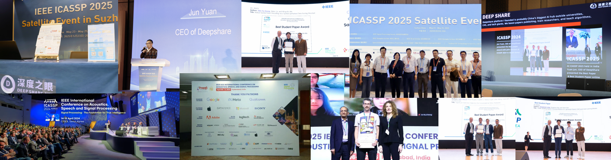

# 【Kaggle】**WSDM Cup - 多语言聊天机器人竞技场** 比赛

比赛名称：**WSDM Cup - 多语言聊天机器人竞技场**

比赛链接：https://www.kaggle.com/competitions/wsdm-cup-multilingual-chatbot-arena

比赛任务：比赛的核心挑战是构建一个能够预测用户在两个匿名LLM生成的回答中更偏好哪一个的模型。与以往类似比赛主要关注英语不同，本次比赛需要处理**多种语言**的对话，对模型的多语言理解和泛化能力提出了更高要求。

---

欢迎大家了解我们深度之眼，希望能够给大家带去最实用的知识：

https://deepshare.feishu.cn/wiki/Tb7IwetysiLErGk3NQwcQdHznPb?from=from_copylink

---

## 1、比赛简介

随着大型语言模型（LLMs）的快速发展，聊天机器人的人机交互能力日益重要。本次比赛由 **WSDM（Web Search and Data Mining）会议**与 **Kaggle**、**LMSYS.org** 联合举办，旨在提升聊天机器人对**人类偏好的理解能力**

## **2、时间安排**

2024 年 11 月  18 日 - 比赛开始日期

2025 年 1 月  27 日 - 参赛作品提交截止日期 & 团队合并截止日期

2025 年 2 月  3 日- 最终提交截止日期

## **3、整个课程的讲解思路和讲课逻辑是怎么样的？**

* **核心任务**：预测人类在匿名聊天机器人对话中会偏好哪个模型的回答，这是一个**多语言文本分类任务**。
* **面向实操**：重点在于熟悉并掌握自然语言处理（NLP）和大语言模型（LLM）相关的特征工程、模型微调与集成技术。
* **关键挑战**：克服模型预测中存在的**位置偏差**（倾向于优先选择先呈现的回答）、**冗长偏差**（偏好更长的回答）和**自我提升偏差**（回答中过于推崇自己）。
* **优化路径**：讲解从基线模型到高级集成的完整提升路径，让参与者能通过持续迭代不断改进模型性能。

### **01课 比赛介绍与Baseline**

**核心内容**

1.**比赛背景**

**目标**：预测用户在多语言环境下对匿名LLM回答的偏好，推动LLM与人类偏好对齐。

​	**任务**：开发一个能够根据提示（Prompt）和两个候选回答（Response A/B）预测用户选择（Winner）的分类模型

​	**评价指标**：**分类准确率**（Classification Accuracy）

2.**数据集概览**

- **训练数据**：`train.parquet`（包含`prompt`, `response_a`, `response_b`, `winner`, `model_a`, `model_b`, `language`）。
- **测试数据**：`test.parquet`（包含`id`, `prompt`, `response_a`, `response_b`, `scored`）
- **关键字段**：`winner`（目标标签，可以是 `model_a`, `model_b` 或 `tie`）、`language`（提示语言，仅训练集有）

3.**Baseline工具** ∙**基础代码**：

使用预训练的多语言Transformer模型（如XLM-RoBERTa, mBERT）进行微调。

 **进阶思路**：采用交叉编码器（Cross-Encoder）架构，将Prompt和Response拼接后输入模型，以获得更深层次的交互表征。

------

### **02课 特征工程与模型搭建**

**核心内容**

1. **特征工程** ∙**文本预处理**：多语言文本清洗、分词。 **文本表示**：使用预训练模型获取文本嵌入；亦可提取传统特征（如TF-IDF、响应长度差、词汇多样性等）作为补充。
2. **模型选择** ∙**预训练模型**：多语言基础模型，如XLM-RoBERTa-large, DeBERTa-v3, mBERT等。 **训练技巧**：分层学习率、针对分类头的精细调优、早停法防止过拟合。
3. **改进路线** ∙**应对偏差**：在输入中明确标识响应位置（如添加`[RESPONSE_A]`和`[RESPONSE_B]`标签），或设计损失函数尝试削弱已知偏差的影响。 **数据利用**：对训练集中的“tie”（平局）样本进行有效处理或数据增强。

------

### **03课 文本数据增强与鲁棒性**

**核心内容**

1. **增强策略** ∙**回译**：尤其适用于低资源语言，通过翻译到其他语言再译回的方式生成语义一致但表述不同的样本。 ∙**同义词替换/随机删除**：引入轻微噪声，提升模型鲁棒性。 ∙**生成对抗样本**：针对模型易错点构造样本，进行对抗训练。
2. **关键工具** ∙**增强库**：`nlpaug`, `textattack`。 ∙**回译工具**：使用Google Translate API或开源多语言翻译模型（如M2M100, NLLB）。
3. **效果排序** ∙**最佳增益**：回译（能有效提升模型泛化能力，尤其对多语言场景）。 ∙**次优**：同义词替换、随机删除。 ∙**需谨慎**：生成对抗样本（可能引入噪声，需控制比例）。

------

### **04课 模型集成与高级策略**

**核心内容**

1. **集成技术** ∙**基础方法**：对同一模型不同训练周期的检查点进行集成。 ∙**进阶方法**： ∙**异构模型集成**：融合不同架构模型（如XLM-RoBERTa, DeBERTa, GPT）的预测结果。 ∙**测试时增强**：对测试样本进行轻微扰动（如多次回译），取多次预测的平均值。 ∙**伪标签**：利用模型对测试集高置信度预测生成伪标签，扩充训练数据。
2. **高级工具** ∙**自动化调参**：NNI, Optuna。 ∙**标签清洗**：`cleanlab`（用于检测训练数据中的错误标签）。

------

### **05课 历史方案与避坑指南**

**核心内容**

1. **往届优秀方案分析（参考类似比赛）** ∙**常见思路**：融合多种预训练模型；精细化的特征工程（如添加语言特征、长度特征）；后处理调整偏差。 ∙**集成策略**：模型堆叠（Stacking）、加权平均。

2. **避坑指南**

   **避免数据泄露**：注意训练数据中提供的`model_a`和`model_b`身份信息仅用于训练分析，不可直接用于测试阶段

​       **关注计算限制**：Kaggle Notebook有严格的**CPU/GPU运行时间限制**（训练≤4.75h，预测≤12h），需优化代码效率

​       **多语言泛化**：确保模型在低资源语言上也有良好表现，避免过拟合高资源语言。

------

### **06课 比赛总结与复盘**

**核心内容**

1.**最终调优**

- **模型压缩**：知识蒸馏、量化，以满足推理时间要求。
- **提交验证**：检查提交格式准确性，确保`winner`字段值为`model_a`或`model_b`

2.**复盘方向** ∙**未充分利用的信息**：思考如何更好地利用`language`字段（训练集中提供）或从`prompt`/`response`中推断出的语言信息来提升多语言性能。 ∙**未来优化**：探索更高效的架构（如DeBERTa）、更先进的集成方法、更智能的偏差缓解策略。

---

说明：需要课程回放的同学可以扫码，凭点赞截图找小享免费领取哦！！！

